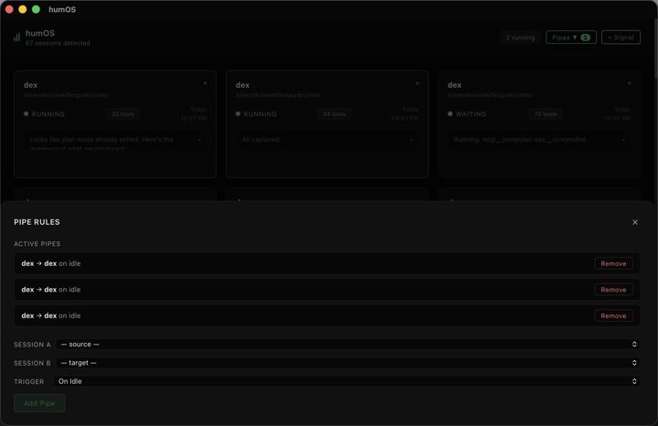
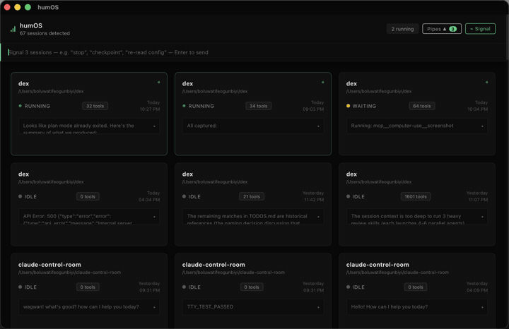

# humOS - Session pipes for any agent CLI

Shell pipes connect commands. Session pipes connect agents.

humOS gives you pipe(), signal(), and (soon) join() across every agent CLI running on your Mac. Claude Code, opencode, Codex CLI, Cursor, Cline. One dashboard. One broadcast. No API costs. Operates on the real sessions you already have open.

**You are the message bus between your agents. humOS takes that job.**

Built for developers who run 3 to 20 parallel agent sessions and are tired of tab-switching to relay context between them. Conductor spawns its own sandboxed sessions. opcode reads JSONL files. claude-control shows a dashboard. humOS operates on the real sessions you already have open, regardless of which agent CLI runs them, and gives you primitives to coordinate them.

Unix gave developers fork, pipe, signal, and join to coordinate processes. Nothing equivalent exists for AI agents on your local machine. humOS is that layer.

---

## Demo



Session A finishes a schema. pipe() fires. Session B picks it up and writes tests. No human relay.



One message. Every session receives it. Two-second undo in case you didn't mean it.

---

## What it does

- **`pipe()`.** Route output from session A to session B automatically. When A goes idle or writes a file matching a glob, a message drops into B's terminal. No human relay. Rules persist in `~/.humOS/pipe-rules.json` and survive restarts.
- **`signal()`.** Broadcast a single message to every active session at once. "Abort." "New constraint: don't touch auth.ts." "Pivot, here's the new direction." One click, all sessions receive it. 2-second undo window in case you typed something you shouldn't.
- **Session dashboard.** Real-time view of every agent CLI session on your machine. Claude Code (read from `~/.claude/projects/`) and opencode (read from `~/.local/share/opencode/opencode.db`). Project name, working directory, status (running, waiting, idle), tool call count, last output line. Refreshed via periodic poll across every registered provider.
- **Per-card actions.** Focus brings the matching Terminal window to front. Send injects a message into one session. Summarize (Claude Code only today) reads the JSONL, calls `claude -p`, and returns a two-sentence summary as a card overlay.

---

## The product is the primitives

The dashboard is what you see when you open humOS. It's useful on its own - live session status, one-click focus, instant summaries. But it's not the product. The product is what happens when you stop being the message bus between your sessions. pipe() fires and session B starts working without you touching a key. signal() redirects every agent at once. join() (coming) aggregates results when they're all done. The dashboard is the inspector. The primitives are the OS.

---

## Why this exists

You're running four Claude sessions. One is writing a schema. One is writing tests against it. One is refactoring the API. One is watching for regressions. The schema session finishes. Now you tab over, copy the file path, tab to the test session, paste it, hit enter. Then tab back. Then tab forward. You are the message bus. That's the problem humOS solves. The first time pipe() fires and a message lands in session B without you touching a key, the thing clicks.

---

## Install

### Option 1: Homebrew (recommended)

```bash
brew tap humos-dev/humos && brew install --cask humos
```

### Option 2: One-liner

```bash
curl -fsSL https://humos.dev/install.sh | sh
```

Downloads the latest release, clears the macOS Gatekeeper quarantine flag from the extracted app, and installs to `/Applications` automatically.

### Option 3: Manual ZIP

1. Download the latest `humOS_X.Y.Z_arm64.zip` from [GitHub Releases](https://github.com/humos-dev/humos/releases/latest)
2. **Before extracting**, clear the macOS quarantine flag from the ZIP:
   ```bash
   xattr -cr ~/Downloads/humOS_*.zip
   ```
3. Double-click the ZIP to extract, drag **humOS.app** to Applications
4. Open normally

> **macOS says "damaged and can't be opened"?** This is Gatekeeper, not actual damage. Run `xattr -cr /Applications/humOS.app` in Terminal, then open again.

**Requirements:**
- macOS 13 or later (Apple Silicon)
- Terminal.app or iTerm2
- At least one supported agent CLI installed and actively in use: [Claude Code](https://www.anthropic.com/claude-code), [opencode](https://opencode.ai)

---

## Quickstart

1. Launch humOS. Your agent sessions appear automatically (Claude Code + opencode), sorted running → waiting → idle.
2. Click **Pipes**, add a rule (session A → session B, trigger: `OnIdle`), hit **Add**.
3. Do work in session A. When it goes idle, watch your pipe message land in session B's terminal.

That's the primitive. Everything else is variations on it.

---

## Status and roadmap

**Shipped (v0.5.6):**
- Session dashboard with grid and list view toggle, periodic poll across every provider
- `pipe()` with `OnIdle` and `OnFileWrite` triggers, persistent canvas edges, pipe history footer
- `signal()` broadcast with undo window, partial-failure reporting, and per-card flash states. Fans out across every registered agent CLI in one call.
- Focus / Send / Summarize per-card actions (grid and list view)
- Dead session indicator with one-click resume command copy
- Project Brain ribbon (cross-session context awareness via daemon)
- In-app update notifications (polls humos.dev/version.json on startup, per-version dismiss)
- **Provider trait abstraction with Claude Code adapter (live)**

**v0.6.0 (in flight):**
- **opencode adapter.** Reads opencode's sqlite database at `~/.local/share/opencode/opencode.db`, surfaces sessions with `provider: opencode`. signal() broadcasts to opencode tabs alongside Claude tabs in one call.
- LP + README rewrite: agent-agnostic copy, opencode visible in install requirements
- Cross-vendor demo: Claude + opencode side-by-side, signal() broadcasts to both

**Next after v0.6.0:**
- `join()`. Wait for multiple sessions to complete, then aggregate their outputs.
- Orchestrator session. An agent session that coordinates other sessions autonomously.
- More adapters: Codex CLI (v0.7), Cursor + Cline (v0.8+)
- iTerm2 support

Full backlog and primitive specs live in [`TODOS.md`](TODOS.md).

---

## Why now

Multi-session workflows are becoming the default way power users run agent CLIs. Anthropic shipped a multi-session sidebar in Claude Code. opencode ships native session management. The race is unwinnable on any single vendor's turf. But no agent vendor will ever coordinate sessions across competitors. That's where humOS lives. If you're already running four agent sessions in parallel and acting as the message bus between them, you're the target user.

---

## Development

```bash
git clone https://github.com/humos-dev/humos
cd humos
npm install
PATH="$HOME/.cargo/bin:$PATH" npm run tauri dev
```

Requires Rust (via [rustup](https://rustup.rs)) and Node.js.

---

## License

MIT - see LICENSE.

---

## Credits

Built by [@BoluOgunbiyi](https://github.com/BoluOgunbiyi). Inspired by Unix process primitives and too many open Claude tabs.
